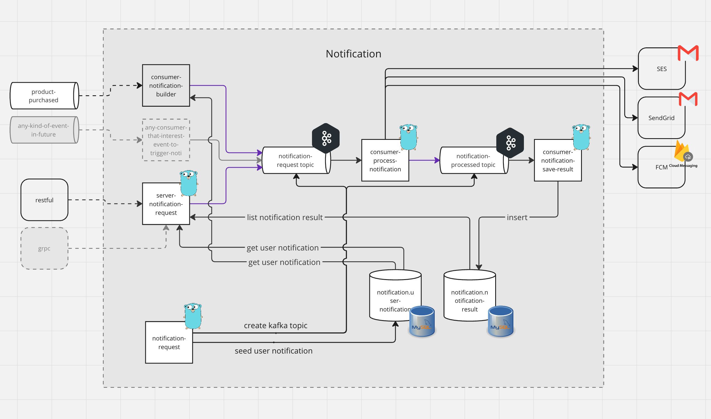

# Scalable Notification System

This is a project assignment from fastwork company to design the notification system that can scalable on spike traffic.

## Table of Contents

1. [Description](#description)
2. [Installation](#installation)
3. [Usage](#usage)
4. [Running Tests](#running-tests)
5. [Note](#note)

## Description

This project was write in golang and contains multiple services that will working together to give notification system working as expect even facing with spike load. This is also contain the business logic of notification as request.

| Event                              | Noti channels | Noti target |
| ---------------------------------- | ------------- | ----------- |
| Buyer sends chat message to seller | Email, Push   | Seller      |
| Buyer purchases product            | Email, Push   | Seller      |
| Remind to pay for pending order    | Push          | Buyer       |
| Purchased items are shipped        | Push          | Buyer       |

### Project Logical view



## Installation

### Prerequisites

- docker desktop
  - This project can running on local environment by using docker desktop.
- make
  - To start the project on local environment. This project need make to run preset of command in makefile.
- go v1.21.+ (need if you want to run test)
  - This project implement on go version 1.21.0

### Setup and Start

I prepared the command via makefile. You can execute step by step

```bash
make dev.infra.up
```

this command will initiate many service like kafka, mysql, redpanda(kafkaconsole) for use with notification services.

```bash
make dev.migrate.up
```

this command introduce migration of kafka topics and mysql database to seed some data

```bash
make dev.up
```

or

```bash
make dev.up.watch
```

this command will running all services include server and consumers to perform

## Usage

This project introduce two way of sending notification.

| Usage        | Description                                                                                                                                      | Use case                                                               |
| ------------ | ------------------------------------------------------------------------------------------------------------------------------------------------ | ---------------------------------------------------------------------- |
| Synchronous  | API will process notification immediately. Waiting for notification request sending to the 3rd party then return 200                             | Need to ensure notification request if success                         |
| Asynchronous | API will accept notification request and process later as soon as possible at system best effort. After accepted the request API will return 202 | No need to wait. Appropriate with huge number of notifications request |

### API

| Path                           | Description                          | Success      |
| ------------------------------ | ------------------------------------ | ------------ |
| POST/notification              | Synchronous request                  | 200 OK       |
| POST/notification/asynchronous | Asynchronous request                 | 202 Accepted |
| GET /notification/:reqId       | Retrieve Notification request result | 200 OK       |
